<h1>Hi, I'm Charles Yang</h1>

<strong>AI builder, full-stack tinkerer, and BUPT student based in Beijing.</strong>

I build small systems that make ideas tangible: AI workflows, web products, backend experiments, model deployment notes, and fast prototypes that teach me something real.

  
  
  
  

 

<table>
  <tr>
    <td width="58%" valign="top">

<h2>Current Focus</h2>

<ul>
  <li><strong>AI-native products</strong>: workflows that feel fast, useful, and a little magical.</li>
  <li><strong>Applied machine learning</strong>: speech, prediction, model conversion, and deployment paths.</li>
  <li><strong>Full-stack systems</strong>: clean UI, reliable APIs, auth, automation, and shipping end to end.</li>
  <li><strong>Learning in public</strong>: notes, experiments, and a personal site that keeps evolving.</li>
</ul>

<pre><code>mode: build small -> learn fast -> write it down -> improve the system</code></pre>

  </td>
  <td width="42%" valign="top" align="center">
    
  </td>
  </tr>
</table>

## Featured Work

| Project | Signal |
| --- | --- |
| [ischarles.github.io](https://github.com/isCharles/ischarles.github.io) | Personal site and public home base. |
| [MiniAuth](https://github.com/isCharles/MiniAuth) | Minimal FastAPI auth system with SQLAlchemy and JWT. |
| [Pytorch2ONNX](https://github.com/isCharles/Pytorch2ONNX) | Practical PyTorch to ONNX conversion guide. |
| [todos](https://github.com/isCharles/todos) | Small JavaScript productivity experiment. |

## Toolbox

**Languages**

**Web / Backend**

**AI / Infra**

 

 
 

<strong>Less noise. More shipped experiments.</strong>

 

Open to collaboration on AI products, practical ML tooling, and clean web systems.

